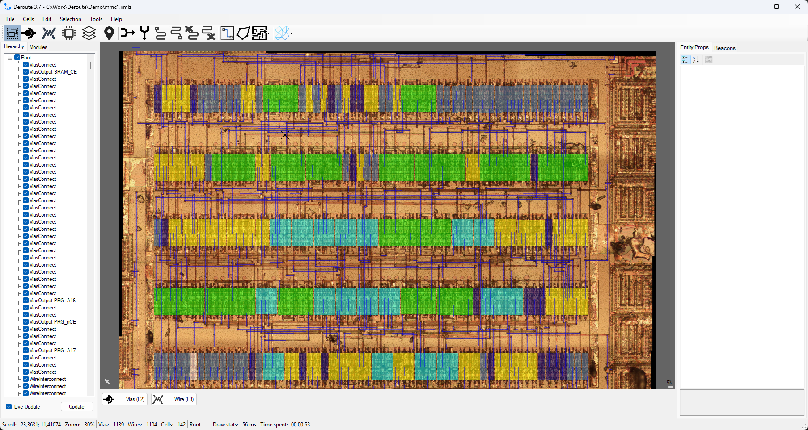

# Demo

This directory contains a demonstration project (a reconstructed netlist of the Nintendo MMC1) for getting acquainted with Deroute.

The chip image can be loaded via the File -> Load Image menu and selecting `MMC1_20X_Fused_sm.jpg`.

The entities that make up the netlist can be loaded via the File -> Add entities menu and selecting `mmc1.xmlz`.

The chip netlist can be saved as Verilog via the File -> Export to Verilog menu, specifying for example `mmc1.v`.