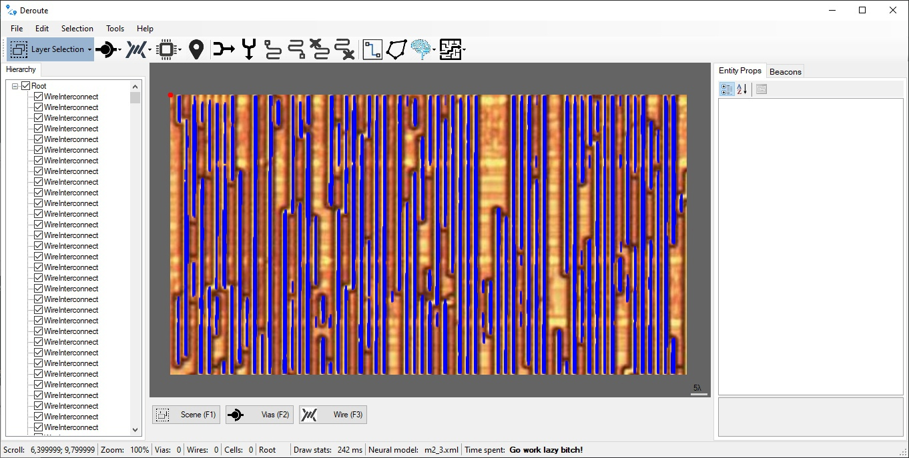

# Deroute manual

## Overview

The Deroute utility is designed for reverse engineering chips and motherboards.

XXX: This manual does not yet include all sections. Basically everything else is self-descriptive and you can just poke the buttons to figure it out.
The instructions will be expanded over time.

## Entity Locator

You can use the entity locator (Tools -> Entity Locator) to quickly get a list of your desired entities.

- You can specify part of the entity name (Label). If the text field is empty, the entity name will be ignored.
- In the list you can select the types of entities required. Besides specifying the exact type (e.g. `ViasInout`) you can also specify "All Vias", "All Wires", "All Cells" or "All Units".

When you double-click the entity will be shown in the main window.

## Machine Learning

Neural networks are used to recognize elements of the chip or PCB being studied (vias, wires, standard cells).

All the functionality to work with neural networks is done through a button with the brain.

### Create ML model

This dialog is used to create a ML model (neural network).

The model includes neural network hyperparameters (such as `learningRate`), as well as a list of features, which are essentially neural network outputs.

A small chunk of the main image (16x16) is fed to the input of the neural network, and the neural network outputs the result (makes a classification).

In place of the found feature an entity is put, which is specified in the `Entities` column.

The list of a feature's properties:
- Name: the name of the feature to display and teach
- Description: just a description for clarity
- Image: just a picture for clarity. You may select any icon for purely informational purposes. A click on it will bring up an icon selection dialog box.
- Entites: Entities which should be added in the place of a recognized feature. Clicking on a cell opens a MiniEntityBox, where you need to draw entities

Suggestions for the number of features:
- You need at least 2 features, so that neural network could make a correct classification.
- It is desirable to choose as many different features as possible. Here you have to use your intuition - if a human being distinguishes one feature from another (for example a vias from a wire), you can expect the same thing from a neural network.

### Load and save ML model

Self-descriptive operations.

The ML model is saved in an XML file.

### View the currently loaded ML model

To see the current ML model, click on `Neural model` in the status bar:

#### Model training

The most fun part.

To train the model, you must first load the source image (File -> Load Image).

The train dialog looks like this:

- Neighbour field: area of the original image from which a small piece, 16x16 pixels, will be taken. You can move the green square with the mouse.
- Feature: the piece which you want to teach the neural network to
- Guess: with this button you can check what the neural network is thinking on the selected feature. This is how you may check if the network is trained. Above the Guess button you will see a description of the feature (the icon you chose when you created the model (Image), the description (Description), and the name of the feature (Name)). If the neural network doesn't know what kind of feature it is, it will tell you so.
- List of Features: in this list you must select the feature you want your neural network to train.
- Next: skip teaching and select next feature. You may do it when there is some garbage on the image or you want to train the neural network in another part of it.
- Train: the neural network is trained with the selected feature from the list

Recommendations for training:
- You should not train a network with one feature in a row. Such training will overtrain and unbalance it. You should try to change fields and teach them different features as often as possible.
- Practice has shown that to train a network for simple recognition (wires, vias) it is enough to teach it about 100-200 times.

### Run the model

To start recognition process, you must first load the source image (File -> Load Image).

After launching, the modeless dialog box with the recognition progress is displayed:

The recognition of the original image is done in a zigzag pattern, with a step of 1 pixel.

The recognition process can be stopped at any time by closing the `Run Model` dialog.

The result of the recognition is something like the following:

XXX: Currently the entities found are overlapping on top of each other, this will be fixed in the next release.

XXX: The dialog currently does not write readiness percentage and does not close automatically, this will be fixed in the next release.

The above flaws do not prevent you from training the model, so your trained model can still be used later, after the above flaws are fixed.

Translated with DeepL.com
