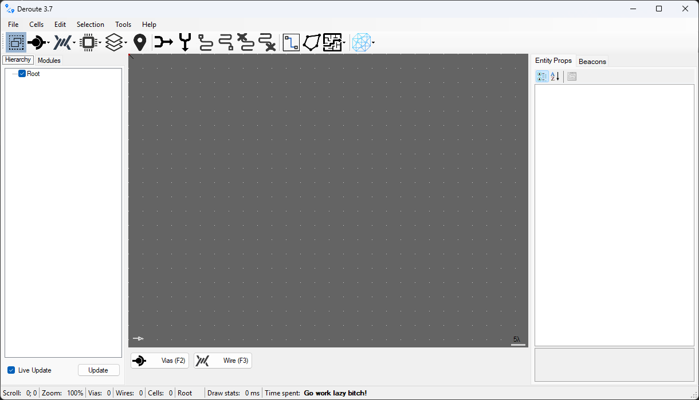
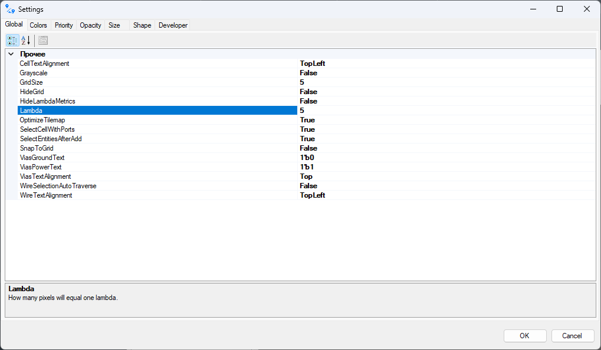
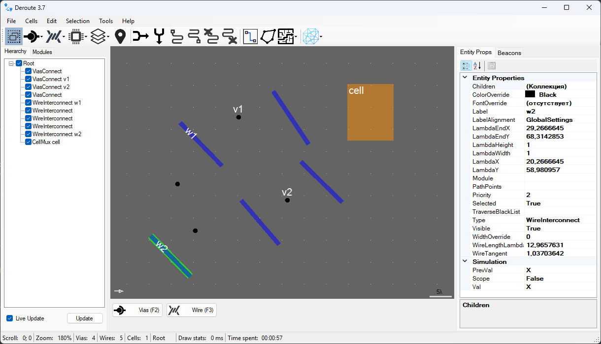
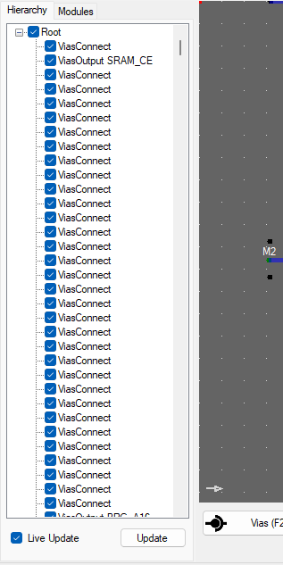
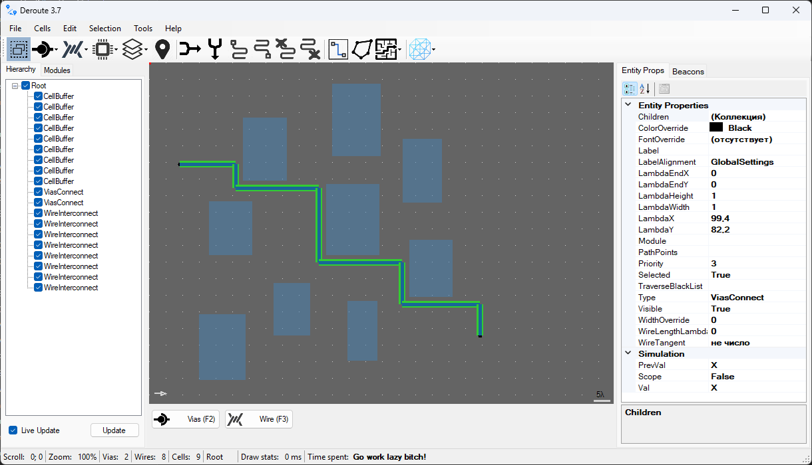
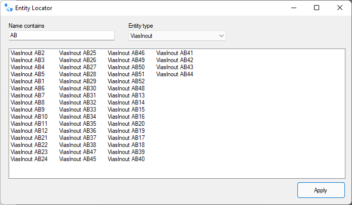
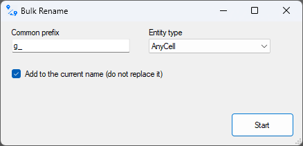
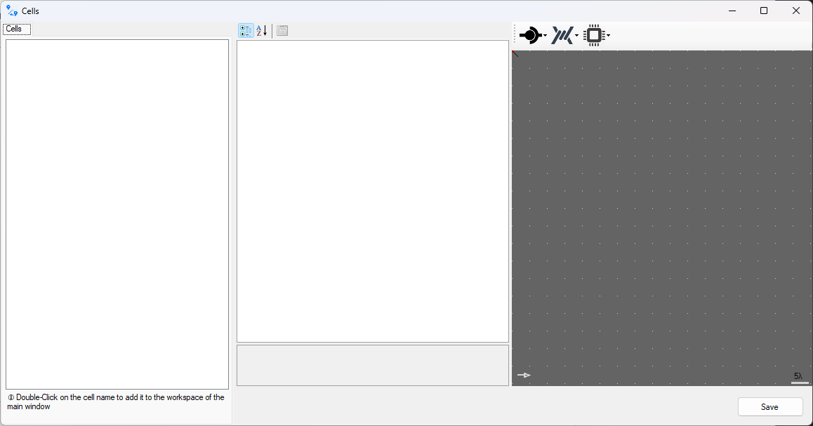

# Руководство пользователя Deroute

## Оглавление

1. [Обзор](#обзор)
2. [Начало работы](#начало-работы)
3. [Рабочее пространство](#рабочее-пространство)
   - [Навигация](#навигация)
   - [Масштабирование](#масштабирование)
   - [Сетка и масштаб](#сетка-и-масштаб)
4. [Типы сущностей](#типы-сущностей)
   - [Виасы (Vias)](#vias)
   - [Провода (Wires)](#wires)
   - [Стандартные ячейки (Cells)](#standard-cells)
   - [Пользовательские блоки (Units)](#custom-units)
   - [Специальные сущности](#special-entities)
5. [Создание сущностей](#создание-сущностей)
6. [Выделение](#выделение)
7. [Слои изображений](#слои-изображений)
8. [Дерево иерархии](#дерево-иерархии)
9. [Свойства сущностей](#свойства-сущностей)
10. [Работа с проводами](#работа-с-проводами)
    - [Удлинение/укорочение проводов](#удлинениеукорочение-проводов)
    - [Слияние коллинеарных проводов](#слияние-коллинеарных-проводов)
    - [Удаление маленьких проводов](#удаление-маленьких-проводов)
    - [Удаление неортогональных проводов](#удаление-неортогональных-проводов)
    - [Маршрутизация проводов (A*)](#маршрутизация-проводов-a)
11. [Traverse (Расширение выделения)](#traverse-расширение-выделения)
12. [Лямбда-масштабирование](#лямбда-масштабирование)
13. [Копирование и вставка](#копирование-и-вставка)
14. [Локатор сущностей](#локатор-сущностей)
15. [Массовое переименование](#массовое-переименование)
16. [Чёрный список traverse](#чёрный-список-traverse)
17. [Управление библиотекой ячеек](#управление-библиотекой-ячеек)
18. [Логическое моделирование](#логическое-моделирование)
    - [Просмотр форм сигналов](#просмотр-форм-сигналов)
19. [Обнаружение пересечений](#обнаружение-пересечений)
20. [Экспорт в Verilog](#экспорт-в-verilog)
21. [Настройки](#настройки)
22. [Горячие клавиши](#горячие-клавиши)
23. [Сохранение и загрузка](#сохранение-и-загрузка)

---

## Обзор

**Deroute** — это Windows-утилита для **реверс-инжиниринга интегральных схем (ИС) и печатных плат (PCB)**. Она предоставляет визуальный редактор, в котором пользователи могут отображать топологию схем микросхем/плат с использованием сущностей, таких как провода, виасы и стандартные ячейки — по сути, «расшифровывая» внутреннюю структуру чипа в представление HDL (языка описания аппаратуры).

Инструмент позволяет:
- Загружать изображения чипов/плат как фоновые справочные изображения
- Рисовать и аннотировать провода, виасы и стандартные ячейки поверх этих изображений
- Выполнять обход и трассировку соединённых проводников
- Выполнять логическое моделирование захваченной схемы
- Экспортировать захваченную топологию в **код Verilog RTL**

> **Примечание:** Данное руководство постепенно расширяется. Разделы, которые ещё не описаны, как правило, самоочевидны — не стесняйтесь исследовать меню и кнопки.

---

## Начало работы

1. Запустите Deroute
2. Загрузите справочное изображение (фото чипа/платы) через управление слоями изображений
3. Начните создавать сущности, используя селектор режимов или горячие клавиши
4. Используйте дерево иерархии для управления структурой сущностей

---

## Рабочее пространство

### Навигация

Основное рабочее пространство — это **бесконечная холст**, на которой размещаются все сущности. Навигация:

- **Правая кнопка мыши + перетаскивание**: Прокрутка холста
- **Колёсико мыши**: Масштабирование (zoom in/out)
- **Клавиша Home**: Сброс вида к началу координат (0, 0)

### Масштабирование

Масштаб влияет на все слои одинаково. Уровень масштаба можно изменить с помощью колёсика мыши или программно через свойство `Zoom`.

### Сетка и масштаб

Deroute использует **лямбда-систему координат** — растрово-независимую систему координат, где:

- **1 лямбда** = наименьший размер элемента, который может произвести технологический процесс изготовления чипа (обычно ширина затвора транзистора)
- Свойство `Lambda` определяет, сколько пикселей экрана соответствуют 1 лямбда
- Сетка рисуется в лямбда-единицах и может включаться/выключаться

> **Совет:** Типичное значение `Lambda` равно 5.0, но его можно изменить в зависимости от масштаба вашего проекта.

---

## Типы сущностей

Сущности — это строительные блоки вашего проекта. Они организованы в следующие категории:

### Виасы (Vias)

Виасы представляют собой контактные точки на чипе/плате:

| Тип | Описание |
|-----|----------|
| `ViasInput` | Входной контакт |
| `ViasOutput` | Выходной контакт |
| `ViasInout` | Двунаправленный контакт |
| `ViasConnect` | Виас, соединяющий два провода |
| `ViasFloating` | Неподключённый («плавающий») виас |
| `ViasPower` | Подключён к питанию (логическая 1) |
| `ViasGround` | Подключён к земле (логический 0) |

### Провода (Wires)

Провода представляют собой электрические соединения:

| Тип | Описание |
|-----|----------|
| `WireInterconnect` | Обычный соединительный провод |
| `WirePower` | Провод питания |
| `WireGround` | Провод земли |

### Стандартные ячейки (Cells)

Стандартные ячейки представляют логические элементы:

| Тип | Описание |
|-----|----------|
| `CellNot` | Инвертор (вентиль НЕ) |
| `CellBuffer` | Буфер (неинвертирующий усилитель) |
| `CellMux` | Мультиплексор |
| `CellLogic` | Логический элемент (NAND, NOR, XOR и т.д.) |
| `CellAdder` | Элемент АЛУ (счётчик/вычитатель) |
| `CellBusSupp` | BusKeeper (хранитель шины) |
| `CellFlipFlop` | Триггер по фронту (например, DFF) |
| `CellLatch` | Триггер по уровню («защёлка») |
| `CellOther` | Прочие/неопределённые ячейки |

### Пользовательские блоки (Units)

Пользовательские блоки для группировки функциональности:

| Тип | Описание |
|-----|----------|
| `UnitRegfile` | Регистровый файл |
| `UnitMemory` | Блок памяти |
| `UnitCustom` | Прочий пользовательский блок |

### Специальные сущности

| Тип | Описание |
|-----|----------|
| `Beacon` | Маркер навигации для быстрого перехода к местоположению |
| `Region` | Область произвольной формы (для группировки/аннотации) |
| `Layer` | Невидимый контейнер для дочерних сущностей (как «слой» в Photoshop) |
| `Root` | Корень дерева иерархии сущностей |

---

## Создание сущностей

Сущности создаются путём выбора соответствующего **режима** из селектора режимов и клика на холсте:

1. Выберите нужный режим типа сущности (например, `ViasInput`, `WireInterconnect`, `CellNot` и т.д.)
2. Кликните на холст для размещения сущности
3. Для проводов: кликайте для установки каждой точки сегмента, правый клик или Enter для завершения
4. Для регионов: кликайте по существующим виасам для определения границы региона

Также можно:
- **Нарисовать регион между выделенными виасами**: Используйте команду «Draw Region Between Selected Vias»
- **Нарисовать провода между выделенными виасами**: Используйте команду «Draw Wire Between Selected Vias»

---

## Выделение

Deroute поддерживает несколько режимов выделения:

- **Одиночное выделение**: Клик по сущности
- **Выделение рамкой**: Нажмите и перетащите в режиме Selection для выделения нескольких сущностей
- **Выделить все типа**: Выделить все сущности конкретного типа одновременно
- **Traverse выделение**: Расширить выделение вдоль соединённых проводов (см. [Traverse](#traverse-расширение-выделения))

Выделенные сущности подсвечиваются цветом `SelectionColor` (по умолчанию: зелёный).

Последняя выделенная сущность отображается сdistinctным выделением. Доступ к ней через `GetLastSelected`.

---

## Слои изображений

Deroute поддерживает **3 слоя изображений** для загрузки фотографий чипов/плат в справочных целях:

### Загрузка изображений

1. Переключитесь на нужный режим слоя изображения (`ImageLayer0`, `ImageLayer1` или `ImageLayer2`)
2. Используйте команду `LoadImage` для загрузки файла изображения

### Управление слоями изображений

Для каждого слоя изображений можно управлять:

| Свойство | Описание |
|----------|----------|
| `ImageOpacity0/1/2` | Прозрачность слоя изображений (0-255) |
| `LockScroll0/1/2` | Заблокировать/разблокировать прокрутку слоя изображений |
| `LockZoom0/1/2` | Заблокировать/разблокировать масштабирование слоя изображений |
| `ScrollImage0/1/2` | Смещение изображения относительно начала координат |

### Советы

- Используйте слои изображений для наложения фотографий чипов/плат как справочных материалов
- Регулируйте прозрачность, чтобы сделать изображение более видимым или более прозрачным
- Блокируйте прокрутку/масштабирование, чтобы предотвратить случайное движение справочных изображений
- Слой 0 — самый верхний слой изображений (ближе всего к слою сущностей)

---

## Дерево иерархии

**Дерево иерархии** отображает все сущности в древовидной структуре:

- **Root** находится вверху дерева
- Дочерние сущности вложены под их родитель
- Каждая сущность имеет **флажок** для переключения видимости
- **Перетаскивание** для изменения родителя сущности
- Используйте **Ctrl+Вверх/Вниз** для изменения порядка дочерних элементов
- **Двойной клик** по сущности для перехода к ней на основном холсте

Дерево иерархии полезно для:
- Управления видимостью больших проектов
- Понимания иерархии ваших сущностей
- Быстрого перехода к конкретным сущностям
- Реорганизации структуры сущностей

---

## Свойства сущностей

Каждая сущность имеет свойства, которые можно просматривать и редактировать в панели **PropertyGrid**:

### Общие свойства

| Свойство | Описание |
|----------|----------|
| `Label` | Текстовая метка, отображаемая рядом с сущностью |
| `LabelAlignment` | Выравнивание текстовой метки |
| `Type` | Тип сущности (перечисление EntityType) |
| `Selected` | Выделена ли сущность |
| `Visible` | Видима ли сущность |
| `Priority` | Приоритет отрисовки (больше = рисуется поверх) |
| `ColorOverride` | Пользовательский цвет (если отличается от цвета по умолчанию для данного типа) |
| `FontOverride` | Пользовательский шрифт для метки сущности |
| `UserData` | Произвольное целочисленное поле данных |

### Свойства координат

| Свойство | Описание |
|----------|----------|
| `LambdaX` | Координата X в лямбда-единицах |
| `LambdaY` | Координата Y в лямбда-единицах |
| `LambdaWidth` | Ширина в лямбда-единицах |
| `LambdaHeight` | Высота в лямбда-единицах |
| `LambdaEndX` | Конечная координата X (для проводов) |
| `LambdaEndY` | Конечная координата Y (для проводов) |

### Свойства только для чтения

| Свойство | Описание |
|----------|----------|
| `WireLengthLambda` | Длина провода в лямбдах (только для проводов) |
| `WireTangent` | Наклон провода (только для проводов) |

### Редактирование меток

Двойной клик по метке сущности для inline-редактирования. После редактирования контрол автоматически обновляется.

---

## Работа с проводами

### Удлинение/укорочение проводов

Можно удлинять или укорачивать концы проводников:

- **Extend Head**: Удлинить начало провода
- **Extend Tail**: Удлинить конец провода
- **Shorten Head**: Укоротить начало провода
- **Shorten Tail**: Укоротить конец провода

Каждая операция удлиняет/укорачивает на небольшое лямбда-значение.

### Слияние коллинеарных проводов

Выделите несколько коллинеарных проводов и используйте **Merge Selected Wires** для объединения их в один провод. Это полезно для очистки проектов с фрагментированными сегментами проводов.

### Удаление маленьких проводов

Используйте **Remove Small Wires** для удаления всех проводов короче указанного порога. Это помогает очистить шум из импортированных или автоматически сгенерированных проектов.

### Удаление неортогональных проводов

Используйте **Remove Non-Orthogonal Wires** для удаления проводов, которые не являются строго горизонтальными или вертикальными. Реальная трассировка PCB/чипа обычно ортогональна.

### Маршрутизация проводов (A*)

Deroute включает **алгоритм поиска пути A*** для автоматической маршрутизации проводов:

1. Выделите два виаса, которые хотите соединить
2. Запустите команду **Wire Router**
3. Алгоритм найдёт путь между виасами, избегая ячеек и регионов как «стен»

> **Примечание:** Ячейки и регионы выступают как препятствия для маршрутизатора. Используйте их стратегически для управления размещением проводов.

---

## Traverse (Расширение выделения)

**Traverse** расширяет текущее выделение вдоль соединённых проводов и через стандартные ячейки:

1. Выделите одну или несколько сущностей
2. Запустите команду Traverse (или используйте горячую клавишу F10-F12)
3. Выделение расширяется, включая все соединённые сущности

### Параметр TierMax

Параметр `TierMax` определяет, насколько глубоко выполнять обход:

| TierMax | Поведение |
|---------|-----------|
| 1 | Остановиться на первой достигнутой стандартной ячейке |
| 2 | Обход через один уровень ячеек |
| 3-5 | Обход глубже через схему |

Более высокие значения позволяют обходить больше уровней схемы, но могут выделить непреднамеренные сущности.

### Как работает Traverse

- Обходит вдоль соединённых сегментов проводов
- Проходит через стандартные ячейки на другую сторону
- Останавливается на ячейках, определённых в `TraverseBlackList` (см. ниже)

---

## Лямбда-масштабирование

**Лямбда-масштабирование** позволяет масштабировать выделенные сущности с помощью коэффициента:

1. Выделите сущности для масштабирования
2. Откройте диалог Lambda Scale (Ctrl+T)
3. Введите коэффициент масштабирования (например, 2.0 для удвоения размера)
4. Примените преобразование

Это полезно для:
- Настройки размеров сущностей под другой масштаб лямбда
- Увелиния мелких деталей для удобства редактирования
- Сжатия больших проектов для размещения в меньшей области

---

## Копирование и вставка

Deroute имеет **внутренний буфер обмена** для сущностей:

- **Ctrl+C**: Копировать выделенные сущности во внутренний буфер обмена
- **Ctrl+V**: Вставить сущности из буфера обмена в позицию перекрестия

Вставленные сущности размещаются в текущих координатах курсора (перекрестия).

---

## Локатор сущностей

**Локатор сущностей** предоставляет быстрый способ поиска и перехода к конкретным сущностям:

**Меню:** Tools -> Entity Locator

### Использование

1. Откройте Entity Locator из меню Tools
2. Введите часть имени сущности (Label) — оставьте пустым для игнорирования фильтра по имени
3. Выберите типы сущностей для включения в поиск:
   - Конкретные типы (например, `ViasInout`)
   - «Все виасы» (All Vias)
   - «Все провода» (All Wires)
   - «Все ячейки» (All Cells)
   - «Все блоки» (All Units)
4. Появится отфильтрованный список
5. **Двойной клик** по сущности в списке для перехода к ней на основном холсте

---

## Массовое переименование

Инструмент **Массовое переименование** позволяет пакетное переименование сущностей:

**Меню:** Tools -> Bulk Rename

### Использование

1. Откройте Bulk Rename из меню Tools
2. Выберите тип сущности для переименования
3. Выберите режим переименования:
   - **Append**: Добавить суффикс к существующим именам
   - **Replace**: Заменить существующие имена шаблоном
   - **Keep first word**: При замене сохранить первое слово оригинального имени
4. Введите шаблон/текст для добавления
5. Примените для переименования всех подходящих сущностей

---

## Чёрный список traverse

Свойство `TraverseBlackList` на каждой сущности определяет, какие типы сущностей операция traverse должна **пропускать**:

### Настройка

1. Выберите сущность в редакторе
2. В PropertyGrid найдите свойство `TraverseBlackList`
3. Нажмите кнопку `...` для открытия диалога конфигурации
4. Добавьте или удалите типы сущностей из чёрного списка
5. Доступны все типы сущностей, кроме `Root`

### Сценарии использования

- Предотвратить соединение проводов с виасами питания/земли при traverse
- Заблокировать обход через определённые типы ячеек
- Контролировать, какие типы сущностей могут быть достигнуты при расширении выделения

### Пример

Если добавить `ViasPower` в `TraverseBlackList` провода, то провод **не будет** соединяться с виасами питания при операциях traverse.

---

## Управление библиотекой ячеек

Deroute включает **Редактор библиотеки ячеек** для создания и управления определениями ячеек:

### Открытие библиотеки ячеек

**Меню:** Tools -> Cell Library (или аналогичный)

### Создание ячеек

1. Откройте редактор библиотеки ячеек
2. Создайте новое определение ячейки
3. Установите растровое изображение ячейки (иконку)
4. Определите сущности ячейки (виасы, провода, стандартные ячейки)
5. Сохраните библиотеку ячеек как XML-файл (поддержка сжатия .xmlz)

### Использование ячеек

- **Двойной клик** по ячейке в библиотеке для размещения в позиции перекрестия
- Ячейки можно редактировать и перемещать после размещения
- Библиотеки ячеек можно сохранять и загружать из XML-файлов

### Формат библиотеки ячеек

Ячейки хранятся в XML с:
- Данными растрового изображения
- Коллекцией сущностей (все дочерние сущности)
- Определениями портов

---

## Логическое моделирование

Deroute включает **логический симулятор** для тестирования захваченной схемы:

### Запуск моделирования

**Меню:** Simulation -> Run (или F5)

### Значения моделирования

Симулятор использует 4 логических значения:

| Значение | Описание |
|----------|----------|
| `X` | Неизвестное/неопределённое |
| `Z` | Высокоимpedансное |
| `Zero` | Логический 0 |
| `One` | Логическая 1 |

### Управление

| Управление | Действие |
|------------|----------|
| F5 | Запуск/остановка моделирования |
| F7 | Шаговое моделирование (один шаг) |

### Scope

Сущности могут быть отмечены как **«Scope»** для записи их значений во время моделирования. Это позволяет отслеживать конкретные сигналы.

---

### Просмотр форм сигналов

**Просмотр форм сигналов** отображает значения сигналов во времени:

**Меню:** View -> Waveform Viewer (или Ctrl+W)

### Использование

1. Отметьте сущности как «Scope» в их свойствах
2. Запустите моделирование (F5)
3. Откройте Waveform Viewer (Ctrl+W)
4. Просмотрщик отображает записанные значения сигналов для всех scoped-сущностей
5. Используйте просмотрщик форм сигналов для анализа временной характеристики и поведения сигналов

---

## Обнаружение пересечений

Deroute может обнаруживать и подсвечивать **пересекающиеся сущности**:

**Меню:** Tools -> Show Overlapped Entities

### Типы обнаруживаемых пересечений

| Тип пересечения | Описание |
|-----------------|----------|
| Cell ↔ Cell | Две пересекающиеся ячейки (с поддержкой полигонов) |
| Region ↔ Region | Два пересекающихся региона |
| Cell ↔ Region | Ячейка внутри или пересекающая регион |
| Wire ↔ Wire | Два пересекающихся провода |
| Via ↔ Via | Два виаса в одной позиции |
| Cell/Region содержит Via | Виас внутри ячейки или региона |
| Wire пересекает Cell/Region | Провод пересекает границу ячейки или региона |
| Via на Wire | Виас размещён поверх провода |

### Использование

1. Загрузите XML-сцену
2. Перейдите в **Tools -> Show Overlapped Entities**
3. Все пересекающиеся сущности подсвечиваются **зелёным** (устанавливается `Selected = true`)
4. Просмотрите подсвеченные сущности
5. Выделите и удалите дубликаты или исправьте пересечения вручную

---

## Экспорт в Verilog

Deroute может экспортировать ваш проект как **код Verilog RTL** — форму «расшифровки» чипа:

**Меню:** Tools -> Export to Verilog

### Принципы конвертации

| Источник | Результат Verilog |
|----------|-------------------|
| Ячейки (`Cell`) | Экземпляры модулей |
| Блоки (`Unit`) | Экземпляры модулей |
| Виасы внутри ячеек/блоков | Порты с именованными подключениями (`.port_name(wire_xxx)`) |
| Виасы верхнего уровня (не в ячейках) | Порты для верхнего модуля |
| Обычные виасы | Провода с открытыми концами |
| Соединённые провода | Имена сетей (сегменты объединены traverse) |
| `ViasPower` | Константа `1'b1` |
| `ViasGround` | Константа `1'b0` |

### Именование экземпляров

- Имя экземпляра берётся из свойства `Label` ячейки/блока
- Первое слово = имя модуля, второе слово (если есть) = имя экземпляра
- Если имя не указано, генерируются имена вида `g1`, `g2` и т.д.
- **Рекомендация:** Всегда называйте ваши ячейки для ясности в HDL-выводе

### Именование проводов

- Имена проводов формируются путём объединения имён всех сегментов с символами подчёркивания (`_`)
- Если результат пустой, генерируются имена вида `w1`, `w2` и т.д.

### Проверка

Экспорт Verilog включает **проверки корректности**:

- **Порты без имени**: Ошибка, если любой порт ячейки/блока не имеет имени
- **Конфликтующие драйверы**: Проверка множественных драйверов на одной сети
- **Плавающие провода**: Сообщает о проводах без подключений

> **Примечание:** Скрипт не выполняет полную проверку связности. Все ошибки следует проверять в предпочитаемом CAD-инструменте после экспорта.

---

## Настройки

Настройки Deroute можно настроить через **диалог настроек**:

**Меню:** Tools -> Settings

### Настраиваемые параметры

| Параметр | Описание |
|----------|----------|
| Размер сетки | Размер отображаемой сетки |
| Привязка к сетке | Привязываются ли сущности к точкам сетки |
| Цвета по умолчанию | Цвета по умолчанию для каждого типа сущности |
| Значение Lambda | Пикселей на единицу лямбда |
| Прозрачность | Прозрачность по умолчанию для виасов, проводов и ячеек |
| Форма виасов | Квадратные или круглые виасы |

### Сохранение настроек

Настройки можно сохранять в XML-файл и загружать из него, что позволяет поддерживать различные профили конфигурации.

---

## Горячие клавиши

Deroute поддерживает следующие **горячие клавиши**:

| Клавиша | Действие |
|---------|----------|
| **F1** | Режим выделения (Selection) |
| **F2** | Режим виаса Connect (ViasConnect) |
| **F3** | Режим провода Interconnect (WireInterconnect) |
| **F4-F9** | Другие режимы создания сущностей |
| **F10** | Traverse, уровень 1 |
| **F11** | Traverse, уровень 2 |
| **F12** | Traverse, уровень 3 |
| **Ctrl+T** | Лямбда-масштабирование |
| **Ctrl+A** | Выделить все сущности |
| **Ctrl+C** | Копировать выделенные сущности |
| **Ctrl+V** | Вставить сущности |
| **Ctrl+S** | Сохранить сцену |
| **Ctrl+R** | Повернуть ячейку на 90 градусов |
| **Ctrl+F** | Отразить ячейку по горизонтали |
| **Ctrl+W** | Открыть просмотр форм сигналов |
| **F5** | Запуск/остановка моделирования |
| **F7** | Шаговое моделирование |
| **Delete** | Удалить выделенные сущности |
| **Escape** | Снять выделение со всех сущностей |
| **Home** | Сброс вида к началу координат |
| **Стрелки** | Переместить выделенные сущности на 0.1 лямбда |
| **Ctrl+Вверх/Вниз** | Изменить порядок дочерних элементов в дереве |

### Пользовательские горячие клавиши

Горячие клавиши можно настроить через **диалог назначений клавиш** (доступен из настроек).

---

## Сохранение и загрузка

### Сохранение сцен

Сцены Deroute сохраняются как **XML-файлы**:

1. **Меню:** File -> Save (Ctrl+S)
2. **Меню:** File -> Save As...
3. Сцены также можно сохранять как **сжатый XML** (`.xmlz`) для уменьшения размера файла

### Загрузка сцен

1. **Меню:** File -> Open
2. Выберите XML или .xmlz файл
3. Сцена загружается со всеми сущностями, изображениями и настройками

### Файлы библиотеки ячеек

Библиотеки ячеек также сохраняются как XML-файлы и могут загружаться/сохраняться независимо от сцен.

---

## Приложение: Контрол EntityBox

Deroute построен на контроле **EntityBox** — переиспользуемом компоненте бесконечного холста. Для разработчиков, заинтересованных в изучении базового контрола, см.:

- [EntityBox README](../EntityBox/Readme.md)
- [EntityBox README (Russian)](../EntityBox/ReadmeRus.md)
