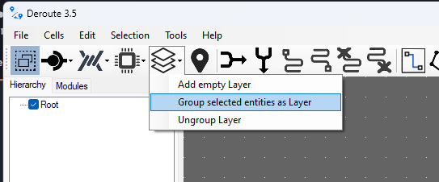
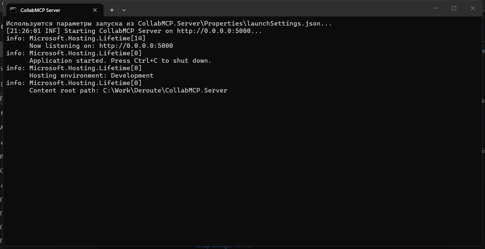
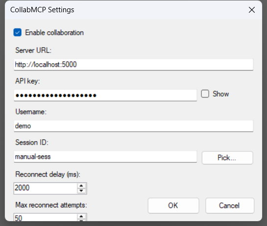
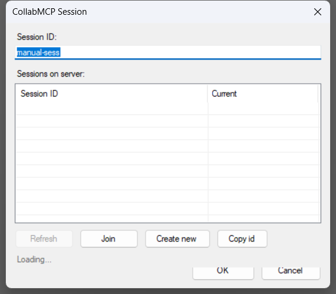
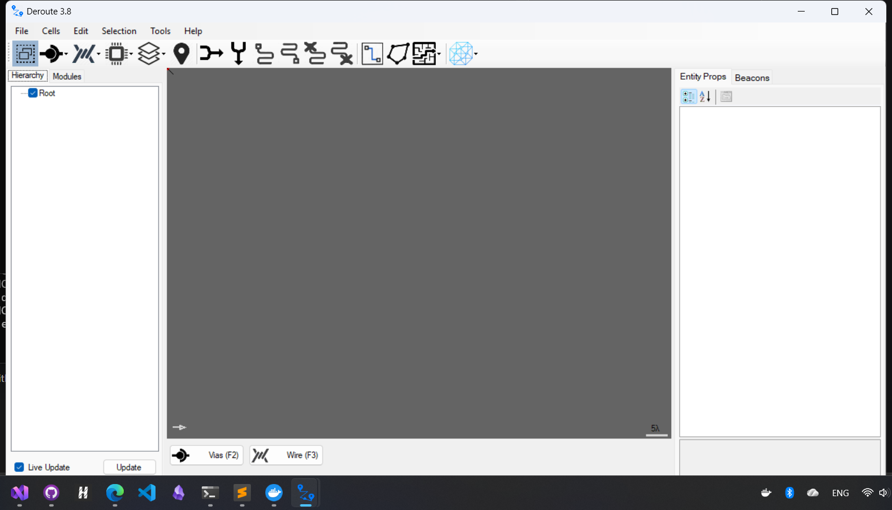
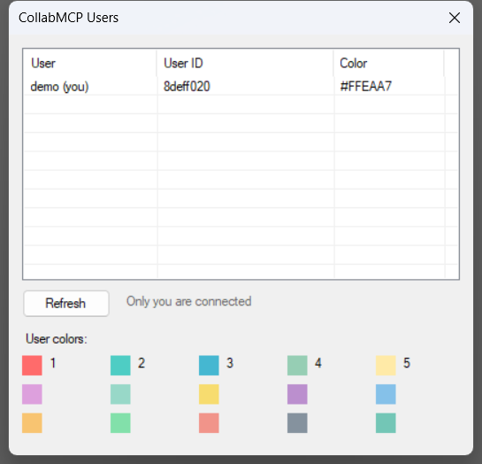

# Руководство пользователя Deroute

## Оглавление

1. [Обзор](#обзор)
2. [Начало работы](#начало-работы)
3. [Рабочее пространство](#рабочее-пространство)
   - [Навигация](#навигация)
   - [Масштабирование](#масштабирование)
   - [Сетка и масштаб](#сетка-и-масштаб)
4. [Типы сущностей](#типы-сущностей)
   - [Виасы (Vias)](#vias)
   - [Провода (Wires)](#wires)
   - [Стандартные ячейки (Cells)](#standard-cells)
   - [Пользовательские блоки (Units)](#custom-units)
   - [Специальные сущности](#special-entities)
5. [Создание сущностей](#создание-сущностей)
6. [Выделение](#выделение)
7. [Слои сущностей](#слои-сущностей)
8. [Дерево иерархии](#дерево-иерархии)
9. [Свойства сущностей](#свойства-сущностей)
10. [Работа с проводами](#работа-с-проводами)
    - [Удлинение/укорочение проводов](#удлинениеукорочение-проводов)
    - [Слияние коллинеарных проводов](#слияние-коллинеарных-проводов)
    - [Удаление маленьких проводов](#удаление-маленьких-проводов)
    - [Удаление неортогональных проводов](#удаление-неортогональных-проводов)
    - [Маршрутизация проводов (A*)](#маршрутизация-проводов-a)
11. [Traverse (Расширение выделения)](#traverse-расширение-выделения)
12. [Лямбда-масштабирование](#лямбда-масштабирование)
13. [Копирование и вставка](#копирование-и-вставка)
14. [Локатор сущностей](#локатор-сущностей)
15. [Массовое переименование](#массовое-переименование)
16. [Чёрный список traverse](#чёрный-список-traverse)
17. [Управление библиотекой ячеек](#управление-библиотекой-ячеек)
18. [Обнаружение пересечений](#обнаружение-пересечений)
19. [Экспорт в Verilog](#экспорт-в-verilog)
20. [Миникарта](#миникарта)
21. [Настройки](#настройки)
21. [Горячие клавиши](#горячие-клавиши)
22. [Сохранение и загрузка](#сохранение-и-загрузка)
23. [Совместная работа (CollabMCP)](#совместная-работа-collabmcp)

---

## Обзор

**Deroute** — это утилита для **реверс-инжиниринга интегральных схем (ИС) и печатных плат (PCB)**, созданная на **.NET Framework 4.8**. Благодаря этому она может работать не только на Windows, но и на других платформах с поддержкой .NET.

Deroute предоставляет визуальный редактор, в котором пользователи могут отображать топологию схем микросхем/плат с использованием сущностей, таких как провода, виасы и стандартные ячейки — по сути, «расшифровывая» внутреннюю структуру чипа в представление HDL (языка описания аппаратуры).

Инструмент позволяет:
- Загружать фоновое изображение (фото чипа/платы) через File -> Load Image
- Рисовать и аннотировать провода, виасы и стандартные ячейки поверх этого изображения
- Выполнять обход и трассировку соединённых проводников
- Экспортировать захваченную топологию в **код Verilog RTL**

> **Примечание:** Данное руководство постепенно расширяется. Разделы, которые ещё не описаны, как правило, самоочевидны — не стесняйтесь исследовать меню и кнопки.

---

## Начало работы

1. Запустите Deroute
2. Загрузите фоновое изображение (фото чипа/платы) через File -> Load Image
3. Начните создавать сущности, используя селектор режимов или горячие клавиши
4. Используйте дерево иерархии для управления структурой сущностей


---

## Рабочее пространство

### Навигация

Основное рабочее пространство — это **бесконечная холст**, на которой размещаются все сущности. Навигация:

- **Правая кнопка мыши + перетаскивание**: Прокрутка холста
- **Колёсико мыши**: Масштабирование (zoom in/out)
- **Клавиша Home**: Сброс вида к началу координат (0, 0)

### Масштабирование

Масштаб влияет на все слои одинаково. Уровень масштаба можно изменить с помощью колёсика мыши или программно через свойство `Zoom`.

### Сетка и масштаб

Deroute использует **лямбда-систему координат** — растрово-независимую систему координат, где:

- **1 лямбда** = наименьший размер элемента, который может произвести технологический процесс изготовления чипа (обычно ширина затвора транзистора)
- Свойство `Lambda` определяет, сколько пикселей экрана соответствуют 1 лямбда
- Сетка рисуется в лямбда-единицах и может включаться/выключаться

> **Совет:** Типичное значение `Lambda` равно 5.0, но его можно изменить в зависимости от масштаба вашего проекта.


---

## Типы сущностей

Сущности — это строительные блоки вашего проекта. Они организованы в следующие категории:

### Виасы (Vias)

Виасы представляют собой контактные точки на чипе/плате:

| Тип | Описание |
|-----|----------|
| `ViasInput` | Входной контакт |
| `ViasOutput` | Выходной контакт |
| `ViasInout` | Двунаправленный контакт |
| `ViasConnect` | Виас, соединяющий два провода |
| `ViasFloating` | Неподключённый («плавающий») виас |
| `ViasPower` | Подключён к питанию (логическая 1) |
| `ViasGround` | Подключён к земле (логический 0) |

### Провода (Wires)

Провода представляют собой электрические соединения:

| Тип | Описание |
|-----|----------|
| `WireInterconnect` | Обычный соединительный провод |
| `WirePower` | Провод питания |
| `WireGround` | Провод земли |

### Стандартные ячейки (Cells)

Стандартные ячейки представляют логические элементы:

| Тип | Описание |
|-----|----------|
| `CellNot` | Инвертор (вентиль НЕ) |
| `CellBuffer` | Буфер (неинвертирующий усилитель) |
| `CellMux` | Мультиплексор |
| `CellLogic` | Логический элемент (NAND, NOR, XOR и т.д.) |
| `CellAdder` | Элемент АЛУ (счётчик/вычитатель) |
| `CellBusSupp` | BusKeeper (хранитель шины) |
| `CellFlipFlop` | Триггер по фронту (например, DFF) |
| `CellLatch` | Триггер по уровню («защёлка») |
| `CellOther` | Прочие/неопределённые ячейки |

### Пользовательские блоки (Units)

Пользовательские блоки для группировки функциональности:

| Тип | Описание |
|-----|----------|
| `UnitRegfile` | Регистровый файл |
| `UnitMemory` | Блок памяти |
| `UnitCustom` | Прочий пользовательский блок |

### Специальные сущности

| Тип | Описание |
|-----|----------|
| `Beacon` | Маркер навигации для быстрого перехода к местоположению |
| `Region` | Область произвольной формы (для группировки/аннотации) |
| `Layer` | Невидимый контейнер для дочерних сущностей (как «слой» в Photoshop) |
| `Root` | Корень дерева иерархии сущностей |

---

## Создание сущностей

Сущности создаются путём выбора соответствующего **режима** из селектора режимов и клика на холсте:

1. Выберите нужный режим типа сущности (например, `ViasInput`, `WireInterconnect`, `CellNot` и т.д.)
2. Кликните на холст для размещения сущности
3. Для проводов: рисование происходит мышкой. Если вы находитесь в режиме `ViasConnect`, то при нажатии **Shift + ЛКМ** рисуется очередной сегмент провода от последнего выделенного виаса
4. Для регионов: кликайте по существующим виасам для определения границы региона

Также можно:
- **Нарисовать регион между выделенными виасами**: Используйте команду «Draw Region Between Selected Vias»
- **Нарисовать провода между выделенными виасами**: Используйте команду «Draw Wire Between Selected Vias»


---

## Выделение

Deroute поддерживает несколько режимов выделения:

- **Одиночное выделение**: Клик по сущности
- **Выделение рамкой**: Нажмите и перетащите в режиме Selection для выделения нескольких сущностей
- **Выделить все типа**: Выделить все сущности конкретного типа одновременно
- **Traverse выделение**: Расширить выделение вдоль соединённых проводов (см. [Traverse](#traverse-расширение-выделения))

Выделенные сущности подсвечиваются цветом `SelectionColor` (по умолчанию: зелёный).

---

## Слои сущностей

В Deroute сущности можно группировать в **слои** (группы) для организации проекта:

### Группировка сущностей

1. Выделите сущности, которые хотите объединить в слой
2. Нажмите **Group**
3. Иерархия при этом изменяется — родителем всех выделенных сущностей становится новый слой
4. Слой создаётся в позиции insertion node (текущая сущность для добавления новых сущностей, отображается в статус-баре)

### Разгруппировка

1. Выберите слой
2. Нажмите **Ungroup**
3. Слой удаляется, а родителем сущностей слоя становится родитель слоя

### Создание пустого слоя

Создание пустого слоя также доступно через кнопку (ранее было в меню Edit).

> **Совет:** Слои помогают организовать большие проекты с тысячами сущностей.



---

## Дерево иерархии

**Дерево иерархии** отображает все сущности в древовидной структуре:

- **Root** находится вверху дерева
- Дочерние сущности вложены под их родитель
- Каждая сущность имеет **флажок** для переключения видимости
- **Перетаскивание** для изменения родителя сущности
- Используйте **Ctrl+Вверх/Вниз** для изменения порядка дочерних элементов
- **Двойной клик** по сущности для перехода к ней на основном холсте

Дерево иерархии полезно для:
- Управления видимостью больших проектов
- Понимания иерархии ваших сущностей
- Быстрого перехода к конкретным сущностям
- Реорганизации структуры сущностей


---

## Свойства сущностей

Каждая сущность имеет свойства, которые можно просматривать и редактировать в панели **PropertyGrid**:

### Общие свойства

| Свойство | Описание |
|----------|----------|
| `Label` | Текстовая метка, отображаемая рядом с сущностью |
| `LabelAlignment` | Выравнивание текстовой метки |
| `Type` | Тип сущности (перечисление EntityType) |
| `Selected` | Выделена ли сущность |
| `Visible` | Видима ли сущность |
| `Priority` | Приоритет отрисовки (больше = рисуется поверх) |
| `ColorOverride` | Пользовательский цвет (если отличается от цвета по умолчанию для данного типа) |
| `FontOverride` | Пользовательский шрифт для метки сущности |
| `UserData` | Произвольное целочисленное поле данных |

### Свойства координат

| Свойство | Описание |
|----------|----------|
| `LambdaX` | Координата X в лямбда-единицах |
| `LambdaY` | Координата Y в лямбда-единицах |
| `LambdaWidth` | Ширина в лямбда-единицах |
| `LambdaHeight` | Высота в лямбда-единицах |
| `LambdaEndX` | Конечная координата X (для проводов) |
| `LambdaEndY` | Конечная координата Y (для проводов) |

### Свойства только для чтения

| Свойство | Описание |
|----------|----------|
| `WireLengthLambda` | Длина провода в лямбдах (только для проводов) |
| `WireTangent` | Наклон провода (только для проводов) |

### Редактирование меток

Двойной клик по метке сущности для inline-редактирования. После редактирования контрол автоматически обновляется.

---

## Работа с проводами

### Удлинение/укорочение проводов

Можно удлинять или укорачивать концы проводников:

- **Extend Head**: Удлинить начало провода
- **Extend Tail**: Удлинить конец провода
- **Shorten Head**: Укоротить начало провода
- **Shorten Tail**: Укоротить конец провода

Каждая операция удлиняет/укорачивает на небольшое лямбда-значение.

### Слияние коллинеарных проводов

Выделите несколько коллинеарных проводов и используйте **Merge Selected Wires** для объединения их в один провод. Это полезно для очистки проектов с фрагментированными сегментами проводов.

### Удаление маленьких проводов

Используйте **Remove Small Wires** для удаления всех проводов короче указанного порога. Это помогает очистить шум из импортированных или автоматически сгенерированных проектов.

### Удаление неортогональных проводов

Используйте **Remove Non-Orthogonal Wires** для удаления проводов, которые не являются строго горизонтальными или вертикальными. Реальная трассировка PCB/чипа обычно ортогональна.

### Маршрутизация проводов (A*)

Deroute включает **алгоритм поиска пути A*** для автоматической маршрутизации проводов:

1. Выделите два виаса, которые хотите соединить
2. Запустите команду **Wire Router**
3. Алгоритм найдёт путь между виасами, избегая ячеек и регионов как «стен»


> **Примечание:** Ячейки и регионы выступают как препятствия для маршрутизатора. Используйте их стратегически для управления размещением проводов.

---

## Traverse (Расширение выделения)

**Traverse** расширяет текущее выделение вдоль соединённых проводов и через стандартные ячейки:

1. Выделите одну или несколько сущностей
2. Запустите команду Traverse (или используйте горячую клавишу F10-F12)
3. Выделение расширяется, включая все соединённые сущности

### Параметр TierMax

Параметр `TierMax` определяет, насколько глубоко выполнять обход:

| TierMax | Поведение |
|---------|-----------|
| 1 | Остановиться на первой достигнутой стандартной ячейке |
| 2 | Обход через один уровень ячеек |
| 3-5 | Обход глубже через схему |

Более высокие значения позволяют обходить больше уровней схемы, но могут выделить непреднамеренные сущности.

### Как работает Traverse

- Обходит вдоль соединённых сегментов проводов
- Проходит через стандартные ячейки на другую сторону
- Останавливается на ячейках, определённых в `TraverseBlackList` (см. ниже)

---

## Лямбда-масштабирование

**Лямбда-масштабирование** позволяет масштабировать выделенные сущности с помощью коэффициента:

1. Выделите сущности для масштабирования
2. Откройте диалог Lambda Scale (Ctrl+T)
3. Введите коэффициент масштабирования (например, 2.0 для удвоения размера)
4. Примените преобразование

Это полезно для:
- Настройки размеров сущностей под другой масштаб лямбда
- Увелиния мелких деталей для удобства редактирования
- Сжатия больших проектов для размещения в меньшей области

---

## Копирование и вставка

Deroute имеет **внутренний буфер обмена** для сущностей:

- **Ctrl+C**: Копировать выделенные сущности во внутренний буфер обмена
- **Ctrl+V**: Вставить сущности из буфера обмена в позицию перекрестия

Вставленные сущности размещаются в текущих координатах курсора (перекрестия).

---

## Локатор сущностей

**Локатор сущностей** предоставляет быстрый способ поиска и перехода к конкретным сущностям:

**Меню:** Tools -> Entity Locator


### Использование

1. Откройте Entity Locator из меню Tools
2. Введите часть имени сущности (Label) — оставьте пустым для игнорирования фильтра по имени
3. Выберите типы сущностей для включения в поиск:
   - Конкретные типы (например, `ViasInout`)
   - «Все виасы» (All Vias)
   - «Все провода» (All Wires)
   - «Все ячейки» (All Cells)
   - «Все блоки» (All Units)
4. Появится отфильтрованный список
5. **Двойной клик** по сущности в списке для перехода к ней на основном холсте

---

## Массовое переименование

Инструмент **Массовое переименование** позволяет пакетное переименование сущностей:

**Меню:** Tools -> Bulk Rename


### Использование

1. Откройте Bulk Rename из меню Tools
2. Выберите тип сущности для переименования
3. Выберите режим переименования:
   - **Append**: Добавить суффикс к существующим именам
   - **Replace**: Заменить существующие имена шаблоном
   - **Keep first word**: При замене сохранить первое слово оригинального имени
4. Введите шаблон/текст для добавления
5. Примените для переименования всех подходящих сущностей

---

## Чёрный список traverse

Свойство `TraverseBlackList` на каждой сущности определяет, какие типы сущностей операция traverse должна **пропускать**:

### Настройка

1. Выберите сущность в редакторе
2. В PropertyGrid найдите свойство `TraverseBlackList`
3. Нажмите кнопку `...` для открытия диалога конфигурации
4. Добавьте или удалите типы сущностей из чёрного списка
5. Доступны все типы сущностей, кроме `Root`

### Сценарии использования

- Предотвратить соединение проводов с виасами питания/земли при traverse
- Заблокировать обход через определённые типы ячеек
- Контролировать, какие типы сущностей могут быть достигнуты при расширении выделения

### Пример

Если добавить `ViasPower` в `TraverseBlackList` провода, то провод **не будет** соединяться с виасами питания при операциях traverse.

---

## Управление библиотекой ячеек

Deroute включает **Редактор библиотеки ячеек** для создания и управления определениями ячеек:

### Открытие библиотеки ячеек

**Меню:** Tools -> Cell Library (или аналогичный)


### Создание ячеек

1. Откройте редактор библиотеки ячеек
2. Создайте новое определение ячейки
3. Установите растровое изображение ячейки (иконку)
4. Определите сущности ячейки (виасы, провода, стандартные ячейки)
5. Сохраните библиотеку ячеек как XML-файл (поддержка сжатия .xmlz)

### Использование ячеек

- **Двойной клик** по ячейке в библиотеке для размещения в позиции перекрестия
- Ячейки можно редактировать и перемещать после размещения
- Библиотеки ячеек можно сохранять и загружать из XML-файлов

### Формат библиотеки ячеек

Ячейки хранятся в XML с:
- Данными растрового изображения
- Коллекцией сущностей (все дочерние сущности)
- Определениями портов

---

## Обнаружение пересечений

Deroute может обнаруживать и подсвечивать **пересекающиеся сущности**:

**Меню:** Tools -> Show Overlapped Entities

### Типы обнаруживаемых пересечений

| Тип пересечения | Описание |
|-----------------|----------|
| Cell ↔ Cell | Две пересекающиеся ячейки (с поддержкой полигонов) |
| Region ↔ Region | Два пересекающихся региона |
| Cell ↔ Region | Ячейка внутри или пересекающая регион |
| Wire ↔ Wire | Два пересекающихся провода |
| Via ↔ Via | Два виаса в одной позиции |
| Cell/Region содержит Via | Виас внутри ячейки или региона |
| Wire пересекает Cell/Region | Провод пересекает границу ячейки или региона |
| Via на Wire | Виас размещён поверх провода |

### Использование

1. Загрузите XML-сцену
2. Перейдите в **Tools -> Show Overlapped Entities**
3. Все пересекающиеся сущности подсвечиваются **зелёным** (устанавливается `Selected = true`)
4. Просмотрите подсвеченные сущности
5. Выделите и удалите дубликаты или исправьте пересечения вручную

---

## Экспорт в Verilog

Deroute может экспортировать ваш проект как **код Verilog RTL** — форму «расшифровки» чипа:

**Меню:** Tools -> Export to Verilog

### Принципы конвертации

| Источник | Результат Verilog |
|----------|-------------------|
| Ячейки (`Cell`) | Экземпляры модулей |
| Блоки (`Unit`) | Экземпляры модулей |
| Виасы внутри ячеек/блоков | Порты с именованными подключениями (`.port_name(wire_xxx)`) |
| Виасы верхнего уровня (не в ячейках) | Порты для верхнего модуля |
| Обычные виасы | Провода с открытыми концами |
| Соединённые провода | Имена сетей (сегменты объединены traverse) |
| `ViasPower` | Константа `1'b1` |
| `ViasGround` | Константа `1'b0` |

### Именование экземпляров

- Имя экземпляра берётся из свойства `Label` ячейки/блока
- Первое слово = имя модуля, второе слово (если есть) = имя экземпляра
- Если имя не указано, генерируются имена вида `g1`, `g2` и т.д.
- **Рекомендация:** Всегда называйте ваши ячейки для ясности в HDL-выводе

### Именование проводов

- Имена проводов формируются путём объединения имён всех сегментов с символами подчёркивания (`_`)
- Если результат пустой, генерируются имена вида `w1`, `w2` и т.д.

### Проверка

Экспорт Verilog включает **проверки корректности**:

- **Порты без имени**: Ошибка, если любой порт ячейки/блока не имеет имени
- **Конфликтующие драйверы**: Проверка множественных драйверов на одной сети
- **Плавающие провода**: Сообщает о проводах без подключений

> **Примечание:** Скрипт не выполняет полную проверку связности. Все ошибки следует проверять в предпочитаемом CAD-инструменте после экспорта.

---

## Миникарта

**Миникарта** — это виджет обзора области просмотра, отображаемый в углу холста EntityBox. Она показывает уменьшенную версию загруженного фонового изображения (или тайлмапа) с прямоугольником, указывающим текущую видимую область.

### Включение миникарты

Миникарту можно включить через **диалог настроек** или программно через `EntityBoxProperties`:

**Диалог настроек:**
- **Меню:** Tools -> Settings

**Свойства EntityBox:**
- `MinimapEnabled` — Включить/выключить миникарту
- `MinimapSizePercent` — Размер миникарты как доля ширины EntityBox (0.0–1.0, по умолчанию: 0.15)
- `MinimapPosition` — Позиция в области просмотра (`TopLeft`, `TopRight`, `BottomLeft`, `BottomRight`, по умолчанию: `TopRight`)
- `MinimapViewportColor` — Цвет прямоугольника области просмотра на миникарте (по умолчанию: красный)
- `MinimapViewportOpacity` — Прозрачность прямоугольника области просмотра (0–255, по умолчанию: 128)
- `MinimapMinSize` — Минимальный размер миникарты в пикселях (по умолчанию: 50)

### Режим изображения

При загрузке фонового изображения миникарта отображает уменьшенную миниатюру всего изображения. Текущая область просмотра показана как цветной прямоугольник поверх изображения.

### Режим тайлмапа

При включённом `OptimizeTilemap` миникарта переключается в режим тайлмапа, отрисовывая тайлмап в уменьшенном масштабе вместо полного изображения. Это полезно для проектов на основе тайлов.

### Навигация по клику

Миникарта поддерживает **навигацию по клику** — клик по области миникарты прокручивает основной вид к выбранной точке, позволяя быстро перемещаться к удалённым частям холста.

---

## Настройки

Настройки Deroute можно настроить через **диалог настроек**:

**Меню:** Tools -> Settings

### Настраиваемые параметры

| Параметр | Описание |
|----------|----------|
| Размер сетки | Размер отображаемой сетки |
| Привязка к сетке | Привязываются ли сущности к точкам сетки |
| Цвета по умолчанию | Цвета по умолчанию для каждого типа сущности |
| Значение Lambda | Пикселей на единицу лямбда |
| Прозрачность | Прозрачность по умолчанию для виасов, проводов и ячеек |
| Форма виасов | Квадратные или круглые виасы |

### Сохранение настроек

Настройки можно сохранять в XML-файл и загружать из него, что позволяет поддерживать различные профили конфигурации.

---

## Горячие клавиши

Deroute поддерживает следующие **горячие клавиши**:

| Клавиша | Действие |
|---------|----------|
| **F1** | Режим выделения (Selection) |
| **F2** | Режим виаса Connect (ViasConnect) |
| **F3** | Режим провода Interconnect (WireInterconnect) |
| **F10** | Traverse, уровень 1 |
| **F11** | Traverse, уровень 2 |
| **F12** | Traverse, уровень 3 |
| **Ctrl+T** | Лямбда-масштабирование |
| **Ctrl+A** | Выделить все сущности |
| **Ctrl+C** | Копировать выделенные сущности |
| **Ctrl+V** | Вставить сущности |
| **Ctrl+S** | Сохранить сцену |
| **Ctrl+R** | Повернуть ячейку на 90 градусов |
| **Ctrl+F** | Отразить ячейку по горизонтали |
| **Delete** | Удалить выделенные сущности |
| **Escape** | Снять выделение со всех сущностей |
| **Home** | Сброс вида к началу координат |
| **Стрелки** | Переместить выделенные сущности на 0.1 лямбда |
| **Ctrl+Вверх/Вниз** | Изменить порядок дочерних элементов в дереве |

---

## Сохранение и загрузка

### Сохранение сущностей

Сущности Deroute сохраняются как **XML-файлы**:

1. **Меню:** File -> Save entities (Ctrl+S)
2. Сущности также можно сохранять как **сжатый XML** (`.xmlz`) для уменьшения размера файла

### Загрузка сущностей

1. **Меню:** File -> Add entities
2. Выберите XML или .xmlz файл
3. Сущности загружаются и добавляются к текущему проекту

### Файлы библиотеки ячеек

Библиотеки ячеек также сохраняются как XML-файлы и могут загружаться/сохраняться независимо от сцен.

---

## Совместная работа (CollabMCP)

Deroute может использоваться **несколькими людьми (и AI-агентами) одновременно** на общем холсте.
Совместная работа идёт через **сервер CollabMCP** — небольшой сервис на ASP.NET Core, который
хранит состояние сессии, синхронизирует изменения в реальном времени (SignalR) и открывает холст
AI-агентам по протоколу Model Context Protocol (MCP).

```
  Deroute (desktop)  <--SignalR (WebSocket)-->  CollabMCP Server  <--MCP (HTTP)-->  AI-агенты
  Пользователь A / B / ...                       (сессии, блокировки,            (добавление/
                                                 XML-хранилище)                   изменение/просмотр)
```

---

### Часть 1. Настройка сервера

#### Требования

- **.NET 10 SDK** (сервер нацелен на `net10.0`).
- Доступ к `nuget.org` для первого восстановления пакетов (используются `Serilog`, `Newtonsoft.Json` и др.).

#### Сборка и запуск

```bat
dotnet build CollabMCP.Server\CollabMCP.Server.csproj -c Debug
dotnet run --project CollabMCP.Server\CollabMCP.Server.csproj -c Debug
```

При запуске сервер печатает баннер и начинает слушать `http://0.0.0.0:5000`:



Проверка работоспособности: `http://localhost:5000/api/health` →
`{"status":"ok","uptime":"..."}`.

#### Конфигурация

Параметры сервера находятся в `CollabMCP.Server/appsettings.json` (секция `Server`):

| Параметр | По умолчанию | Описание |
|----------|--------------|----------|
| `Url` | `http://0.0.0.0` | Адрес привязки |
| `Port` | `5000` | HTTP-порт |
| `AdminApiKey` | `change-me-admin-key` | **API-ключ** — каждый запрос клиента/агента должен его передавать |
| `XmlStoragePath` | `./sessions` | Папка с XML-файлами сессий (создаётся автоматически) |
| `LogPath` | `./Logs` | Ежедневные логи Serilog |
| `ThrottleIntervalMs` | `33` | Интервал рассылки позиционных обновлений (~30 FPS) |

Любое значение можно переопределить переменными окружения с префиксом `Server__`, например
`Server__Port=6000` или `Server__AdminApiKey=my-secret`.

#### API-ключи и пользователи

На сервере **нет учётных записей и паролей**. Доступ контролируется одним общим
**API-ключом** (`Server.AdminApiKey`):

- Каждый запрос (REST, MCP, WebSocket) должен передавать заголовок **`X-Api-Key: <ключ>`**.
- Нет заголовка → `401`; неверный ключ → `403`; открыт только `/api/health`.
- **Перед реальным использованием обязательно смените `change-me-admin-key`.**

«Пользователь» внутри сессии определяется строкой **UserId**, которую клиент передаёт при
подключении (`JoinSession`). Клиент Deroute генерирует её автоматически
(`Tools -> Settings -> CollabMCP`), её можно изменить. UserId также является владельцем
блокировок: сущность, заблокированная одним пользователем, доступна для изменения только ему.

#### Хранение сессий

Каждая сессия хранится как **XML-файл** в `XmlStoragePath` (один файл на id сессии,
`sessions\<id>.xml`), создаётся лениво при первом обращении. Полезные эндпоинты:

| Эндпоинт | Назначение |
|----------|------------|
| `GET /api/health` | Проверка работоспособности (без ключа) |
| `GET /api/sessions` | Список id сессий (API-ключ) |
| `GET /api/sessions/{id}` | Метаданные сессии + число сущностей + подключённые пользователи |
| `DELETE /api/sessions/{id}` | Удалить сессию (память + файл) |
| `/mcp`, `/mcp/sse`, `/mcp/events`, `/mcp/tools`, `/mcp/prompts`, `/mcp/resources` | MCP для AI-агентов |

> Подробное описание протокола: [CollabMCP.Server/ReadmeRus.md](../CollabMCP.Server/ReadmeRus.md).

---

### Часть 2. Подключение из клиента Deroute

#### Шаг 1 — Запустите сервер

Запустите сервер, как описано выше, запомните адрес (`http://localhost:5000`) и **API-ключ**
(`AdminApiKey`).

#### Шаг 2 — Параметры подключения

Откройте `Tools -> Settings`, вкладка **CollabMCP**, нажмите **"Open CollabMCP settings..."**:



Заполните:

- **Enable collaboration** — включено.
- **Server URL** — `http://localhost:5000` (или реальный адрес сервера).
- **API key** — `AdminApiKey` сервера (скрыт; пункт **Show** показывает его).
- **Username** — имя, которое увидят другие участники.
- **User ID** — идентификатор в сессии (генерируется автоматически; кнопка **Regenerate**
  создаёт новый). Используйте **разный User ID в каждом экземпляре приложения** (например,
  при тестировании двух копий на одной машине), чтобы участники считались раздельно.
- **Session ID** — необязательно; можно выбрать позже из списка сессий.
- **Reconnect delay / Max attempts** — поведение автоматического переподключения.

Нажмите **"Test connection"**, чтобы проверить доступность сервера, затем **OK**.

#### Шаг 3 — Выбор или создание сессии

В строке состояния щёлкните правой кнопкой по индикатору **CollabMCP:** и выберите **Session...**:



- **Refresh** загружает список сессий с сервера.
- Выберите сессию и нажмите **Join**, либо введите новый id и нажмите **Create new**.
- **Copy id** копирует id сессии в буфер обмена.
- **OK** — приложение переподключается к выбранной сессии **без перезапуска**.

Можно также вписать id сессии прямо в диалоге настроек.

#### Шаг 4 — Подключение

Щёлкните правой кнопкой по индикатору **CollabMCP:** в строке состояния и выберите **Connect**.
**Автоматического подключения нет**: клиент стартует в состоянии *Ready* (если коллаб включён и
задан API-ключ) или *Disabled* и подключается только по команде Connect. Индикатор показывает
состояние цветом:

| Состояние | Цвет | Значение |
|-----------|------|----------|
| `Collab: Disabled` | серый | Совместная работа выключена |
| `Collab: Ready` | стальной синий | Включено и настроено, ещё не подключено |
| `Collab: Connecting...` | оранжевый | Подключение / переподключение |
| `Collab: Connected (N users, session: ...)` | зелёный | Подключено, участников: N |
| `Collab: Disconnected` / `Collab: Error` | красный | Соединение потеряно / ошибка |

Подробности и тексты ошибок показываются в метке сообщения рядом с индикатором. При успешном
подключении холст заполняется снимком сессии.



#### Пользователи и цвета

Правый клик по индикатору → **Users...** открывает окно участников. Каждому участнику
назначается цвет из палитры из 15 цветов; легенда показана внизу окна:



#### Совместная работа

- Сущности, которые вы **создаёте, правите, перемещаете или удаляете**, синхронизируются в
  реальном времени; перемещение (позиционные обновления) ограничено ~30 обновлениями в секунду.
- **Блокировки:** перед редактированием заблокируйте сущность (правый клик по сущности, если в
  вашей сборке есть управление блокировками, либо через AI-агента). Заблокированная сущность
  окрашивается в цвет владельца и может изменяться только им. При отключении пользователя его
  блокировки снимаются автоматически.
- **Офлайн-очередь:** при потере соединения локальные изменения помещаются в очередь и
  отправляются автоматически после переподключения — можно продолжать работу офлайн.
- **AI-агенты** могут просматривать и изменять холст через MCP-инструменты (`add_primitive`,
  `update_primitive`, `delete_primitive`, `clear_canvas`, `get_canvas_state`, `list_sessions`).

#### Возможные проблемы

| Симптом | Вероятная причина / решение |
|---------|------------------------------|
| "Connection failed" | Сервер не запущен, неверный порт или в URL нет `http://` |
| "API key required / Invalid API key" | Ключ в настройках отличается от `Server.AdminApiKey` |
| Индикатор остаётся красным после попыток | Сервер недоступен; проверьте порт/файрвол |
| "Entity locked by ..." при обновлении | Другой пользователь (или агент) держит блокировку; дождитесь снятия |

---

## Приложение: Контрол EntityBox

Deroute построен на контроле **EntityBox** — переиспользуемом компоненте бесконечного холста. Для разработчиков, заинтересованных в изучении базового контрола, см.:

- [EntityBox README](../EntityBox/Readme.md)
- [EntityBox README (Russian)](../EntityBox/ReadmeRus.md)
